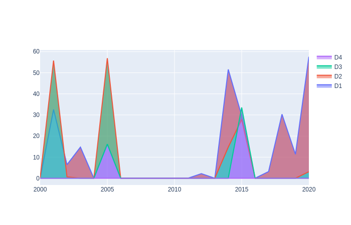

    
      
    <i>Washington State, Wheat Fields, 1904. New York Public Library / Public domain</i>

# Does agriculture decline during droughts in Washington State?

## Exploring the impact drought has on wheat in Washington, in the top 5 agrarian counties, according to yield (bushels per acre)

    Data Sources:
    
    - USDA National Agriculture Statistic Service (NASS)
        nass.usda.gov
   
    - The National Integrated Drought Information System
        drought.gov
        
Hypothesis (Null):

- Drought years did not see a decrease in food yield.

## Overview:

    

## Drought Intensity Classifications

    None : Normal Percipitation
    D0 (Abnormally Dry)
    D1 (Moderate Drought)
    D2 (Severe Drought)
    D3 (Extreme Drought)
    D4 (Exceptional Drought)
   
   
# Drought Levels in Key Agrarian Counties

    

        
        Grant County Drought Periods 

        
        Lincoln County Drought Periods 

        
        Okanogan County Drought Periods 

        
        Whitman County Drought Periods 

        
        Yakima County Drought Periods 

# Wheat Yields in Key Agrarian Counties

        
        

        
        

        
        

        
        

        
        

        
        
# Overview of Key Agrarian Counties

        
        

        
        

        
        

        
        

        
        

